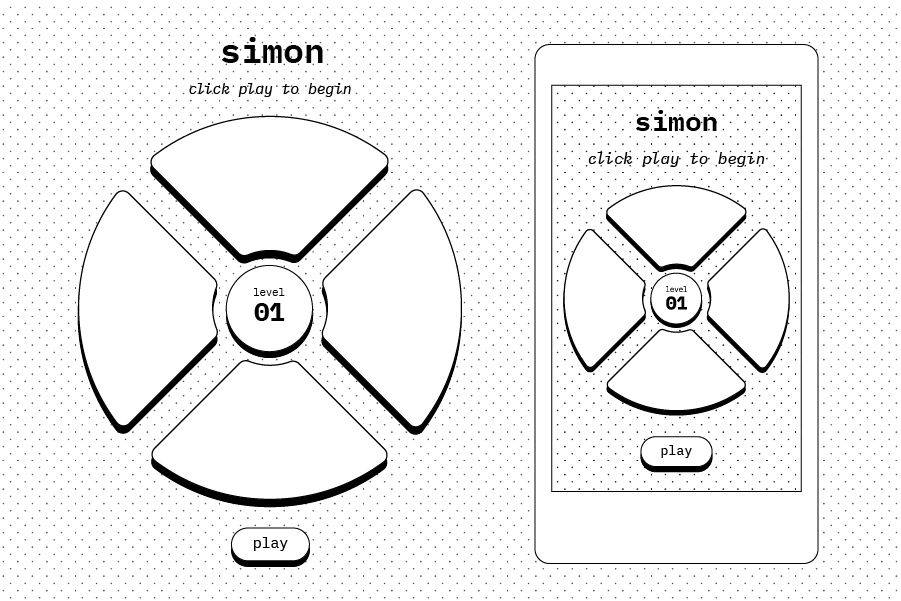

# Simon

Simon is a game of memory that increases in difficulty each round. Replicate the sequence to progress to the next round. Once you fail to match the sequence, the game is over.

[Play demo.](https://j0w00.github.io/ga-p1-simon/)

## Screenshots

- Images of your actual game.

## Technologies Used

- JavaScript
- HTML
- CSS

## Getting Started

- In this section include the link to your deployed game and any instructions you deem important.

## Next Steps

- Style / button color updates
- Animate button press
- Timer / countdown for player's turn
- Keep 'High Score' and make persist using localStorage

## Known Issues

- mousedown / mouseup bug with buttons staying 'lit' if mouseup event happens off element

## Planning & Pseudocode

- Define constant of BUTTONS as an object with a property for each button (0-3).
    - '0': 'green' ... '3': 'red'
- Initialize variables for:
    - Current level as a Number of 1
    - Simon's current sequence as an empty Array
    - Player's current sequence as an empty Array
- Render view to DOM with start/play button.
- When user clicks start/play button and triggers event handler:
    - Hide play button
    - Disable game buttons
    - Run Simon's play function (below)
    - After that completes, show 'Your turn' message/feedback and enable game buttons
    - Wait for player to click a button, which triggers player's turn function below
- Simon's play function
    - Get number of buttons from constant set in step 1 to determine random number range.
    - Generate the amount of random numbers needed to equal the current level.
    - Example: Level 1 would need 1 random number between 0-3 so that "Simon" can start their sequence for the player. Level 2, 2 random numbers between 0-3, etc.
    - Save/push the random numbers into the current sequence array initialized in step 2 so that we can see if the player's sequence matches during their turn.
    - Show the sequence to the player by looping through current sequence array and updating the style of the button the index belongs to. Opacity or rgba background could be used to show the active button.
- Player's turn function
    - Animate, show active status of button clicked
    - Get index of button and pass along to compare function below
- Compare Simon's and Player's sequences
    - Will take in current button index from player's event
    - Inside, add/push index argument to player's sequence array
    - If they match, will continue to allow player to choose until both arrays are of the same length. Increment level variable by 1, reset everything else.
    - If does not match, end and show 'End of game' message/feedback. Reset entire game.